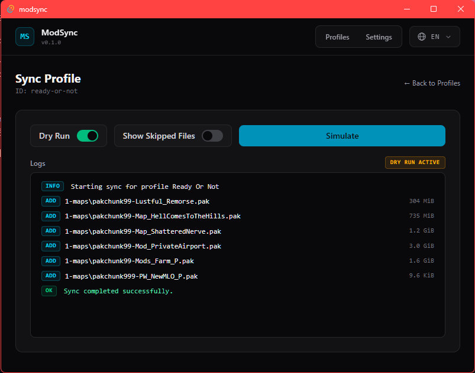

# ModSync

ModSync is a fast file-synchronization tool designed to keep game mod directories in sync.



## Why

Creating Windows directory junctions to store large game mods on a secondary HDD can cause severe loading bottlenecks, especially with heavy UE5 mods. ModSync solves this by keeping your mods on faster storage through recursive hardlinking or direct file copying instead of using full folder junctions. It will probably never automatically sync though.

## Features

- **Hardlink & Copy Modes:** Recursively hardlinks or copies files to avoid I/O bottlenecks on slower storage devices.
- **Granular Exclusions:** Exclude specific files or directories from sync or delete operations.
- **Safe Mirroring:** Selective deletion rules prevent unintended data loss when mirroring source structures.
- **Modern GUI:** Built with Tauri and SvelteKit, RAM usage is minimal (2-10 MB).
- **Cross-Platform:** Runs on Windows, Linux, and macOS (in theory).

## Installation

You can install ModSync from one of the bundles on the [releases](https://github.com/DarkCeptor44/modsync/releases) page.

If not you can setup [Tauri](https://tauri.app/start/) and build it yourself.

## MSRV

The minimum supported Rust version is:

| Version | Edition | MSRV |
| --- | --- | --- |
| `<= 0.2.0` | 2024 | 1.98.0 |

## Environment Variables

The following environment variables are currently supported:

| Variable | Default | Description |
| --- | --- | --- |
| `DEBUG` | `false` | Enable debug logging |

## Audits

| Auditor | Audit Date | Version | Vulnerabilities |
| --- | --- | --- | --- |
| [cargo-audit](https://crates.io/crates/cargo-audit) | 2026-10-01 | 0.2.0 | 2* |

- Although these are technically considered vulnerabilities, I personally wouldn't worry about unmaintained or unsound crates. Besides it's on Tauri's side, if they update the dependencies I'll update Tauri.

    ```text
    Crate:     proc-macro-error
    Version:   1.0.4
    Warning:   unmaintained
    Title:     proc-macro-error is unmaintained
    Date:      2024-09-01
    ID:        RUSTSEC-2024-0370
    URL:       https://rustsec.org/advisories/RUSTSEC-2024-0370

    Crate:     glib
    Version:   0.18.5
    Warning:   unsound
    Title:     Unsoundness in `Iterator` and `DoubleEndedIterator` impls for `glib::VariantStrIter`
    Date:      2024-03-30
    ID:        RUSTSEC-2024-0429
    URL:       https://rustsec.org/advisories/RUSTSEC-2024-0429
    ```

## License

This project is licensed under the [Mozilla Public License, version 2.0](https://www.mozilla.org/en-US/MPL/2.0/). See the [LICENSE](./LICENSE) file for details.
